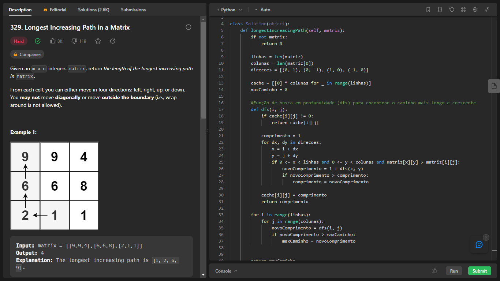
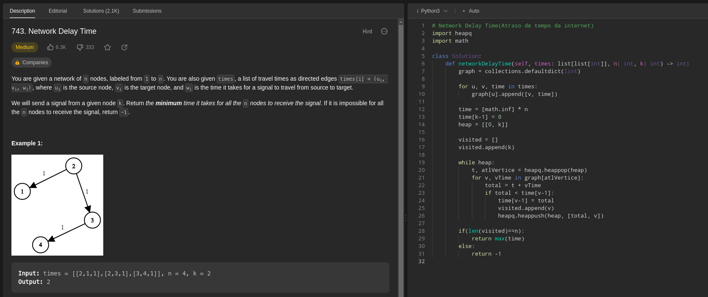
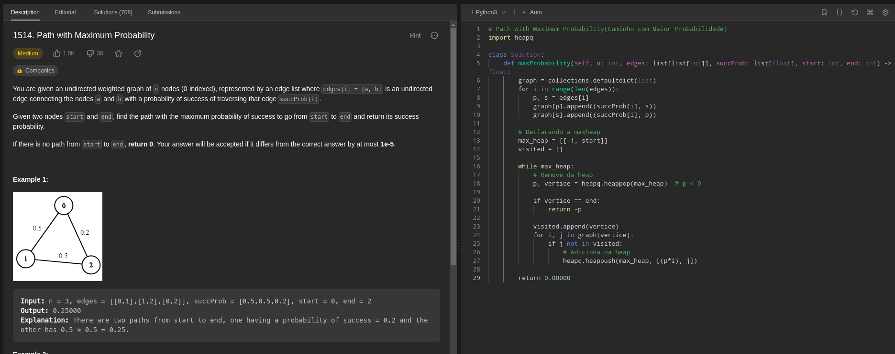

# Grafos2_Exercicios_Dupla39

**Número da Lista**: 2 
**Conteúdo da Disciplina**: Grafos 2 

## Alunos
|Matrícula | Aluno |
| -- | -- |
| 17/0154319  |  Philipe de Sousa Barros |
| 20/0042416  |  Pablo Christianno Silva Guedes |

## Sobre 
Este trabalho envolve a resolução de exercícios que abordam o conteúdo do módulo de Grafos 2 da disciplina de Projeto de Algoritmos. O foco principal é a aplicação de algoritmos em problemas relacionados a grafos.

## Screenshots
### Exercicio 1 - "Longest Increasing Path in a Matrix"
**Nível do exercício:** Difícil

Para acessar a página do exercício [clique aqui](https://leetcode.com/problems/longest-increasing-path-in-a-matrix/)

**Linguagem**: Python 
**Framework**:  
### Vídeo do Exercício 1 
O arquivo do vídeo (.mp4) do exercício um se encontra na pasta videos -> [video](https://github.com/projeto-de-algoritmos/Grafos2_Exercicios_Dupla39/blob/master/videos/Exercicio1_Philipe.mp4)

Disponível também no Youtube [clique aqui](https://www.youtube.com/watch?v=-wiobLXsRFA)

### Exercicio 2 - "Network Delay Time"
**Nível do exercício:** Médio

Para acessar a página do exercício [clique aqui](https://leetcode.com/problems/network-delay-time/)

**Linguagem**: Python 
**Framework**:  
### Vídeo do Exercício 2
O arquivo do vídeo (.mp4) do exercício dois se encontra na pasta videos -> [video](https://github.com/projeto-de-algoritmos/Grafos2_Exercicios_Dupla39/blob/master/videos/Exercicio2_Pablo.mp4)
 
Disponível também no Youtube [clique aqui](https://youtu.be/0fVShT9Xg5k)

### Exercicio 3 - "Path with Maximum Probability"
**Nível do exercício:** Médio

Para acessar a página do exercício [clique aqui](https://leetcode.com/problems/path-with-maximum-probability/description/)

**Linguagem**: Python 
**Framework**:  
### Vídeo do Exercício 3 
O arquivo do vídeo (.mp4) do exercício dois se encontra na pasta videos -> [video](https://github.com/projeto-de-algoritmos/Grafos2_Exercicios_Dupla39/blob/master/videos/Exercicio3_Pablo.mp4)

Disponível também no Youtube [clique aqui](https://youtu.be/nEJsPQrYQ7E)

## Outros 
Quaisquer outras informações sobre seu projeto podem ser descritas abaixo.

